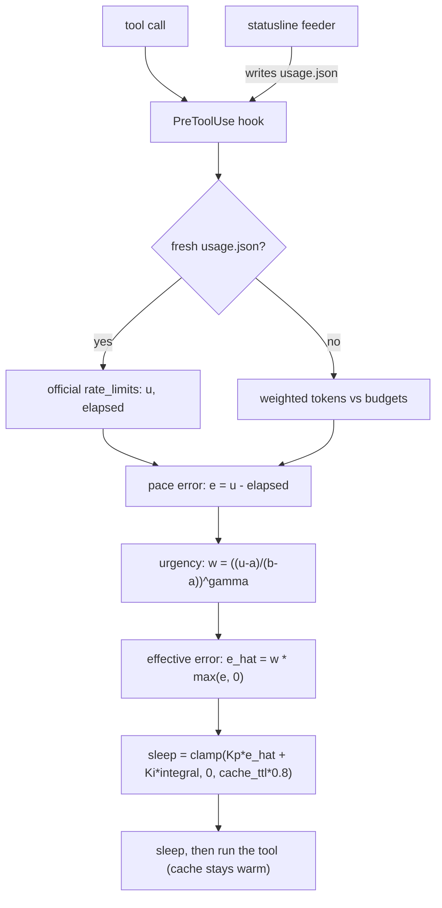
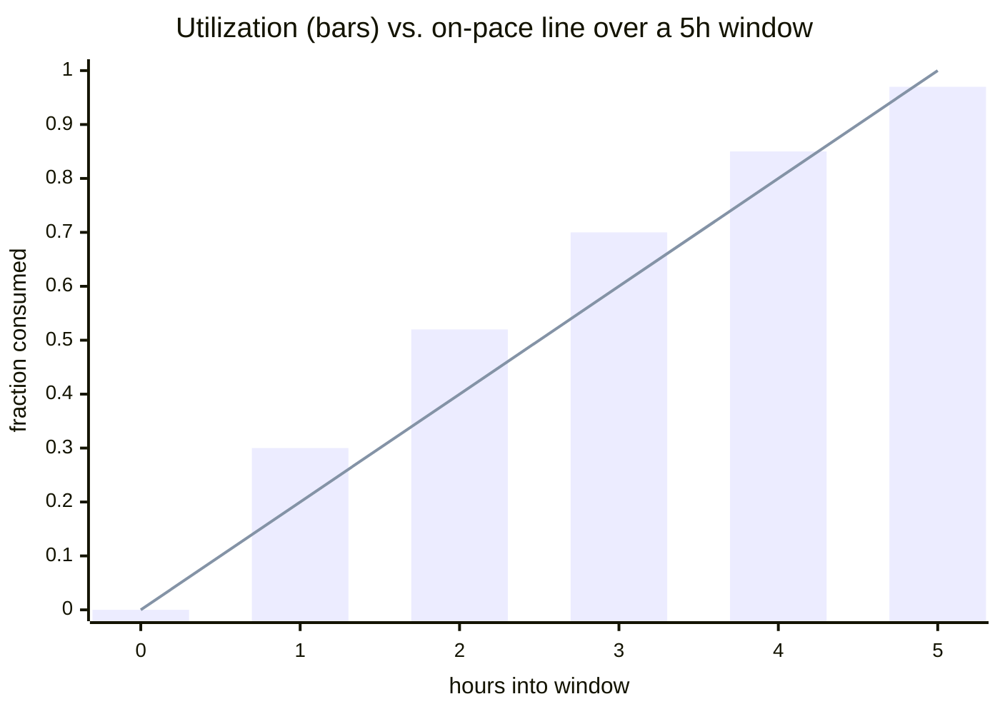
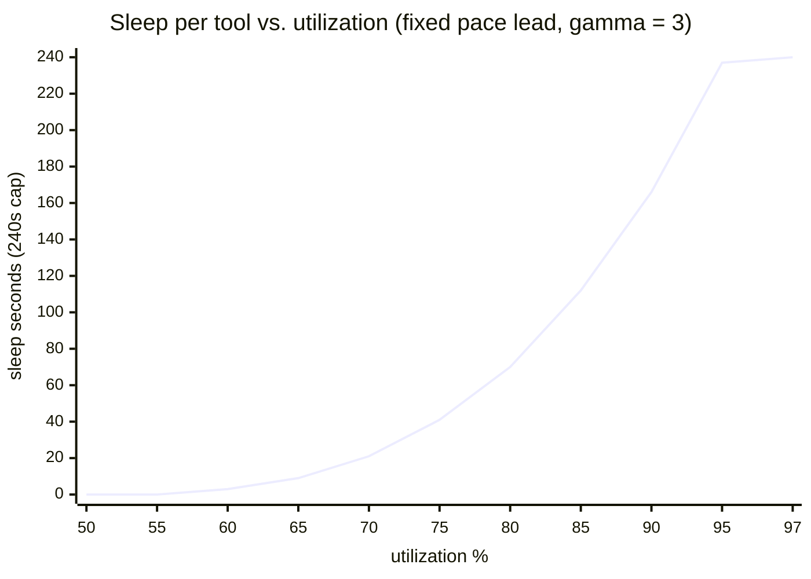

# cc-slower

[](https://github.com/bvc3at/cc-slower/actions/workflows/ci.yml)

Adaptive slowdown for Claude Code sessions. When your 5-hour or 7-day usage
window is burning faster than wall time, a `PreToolUse` hook inserts sleeps
between tool calls — long enough to stretch the budget across the window,
short enough that the prompt cache **never expires** (an expired cache forces
re-computation of the whole conversation, which costs far more than the
throttling saves).

## How it works



- **Usage source (primary):** Claude Code passes official `rate_limits`
  (`five_hour` / `seven_day`, `used_percentage`, `resets_at`) to the
  statusline command. `hooks/cc_slower_statusline.py` captures that to
  `usage.json`; your existing statusline keeps working (it gets chained).
- **Usage source (fallback):** if `usage.json` is missing or stale, the hook
  counts cost-weighted tokens from session transcripts against configurable
  budgets (works offline, needs calibration; transcript format is not a
  stable interface, so this is best-effort).
- **Controller:** one PI regulator per window, the neediest window wins.
  The pace error `utilization − elapsed_fraction of the window` is gated by a
  convex **urgency weight** `w(u)` (≈0 far from the limit, 1 near it) before it
  drives the loop, so throttling ramps in with *proximity to the cap* rather
  than with raw pace — a lead you can easily afford at 51% costs nothing, the
  same lead at 90% costs almost the full cap (see [The math](#the-math)). The
  integral term (with anti-windup clamp and decay) supplies the steady-state
  sleep a pure proportional term can't; the derivative gain exists but defaults
  to 0 because utilization is a coarse, step-like signal and D just amplifies
  noise.
- **State** (controller integrals, window anchors, token accounting, sleep
  dedupe) lives in one flock-protected JSON file, so multiple concurrent
  sessions share the picture and throttle together.

### The math

Per window, on every `PreToolUse`:

```
e     = utilization − elapsed_fraction         # pace error; e > 0 ⇒ ahead of pace
w(u)  = clamp((u − a) / (b − a), 0, 1) ** γ     # urgency: 0 at a, 1 at b, convex for γ > 1
ê     = w(u) · max(e, 0)                        # effective (urgency-weighted) error
sleep = clamp(Kp·ê + Ki·∫ê dt, 0, cache_ttl · sleep_cap_fraction)
```

with `a = activation_utilization` (0.50), `b = hard_limit_utilization` (0.97),
`γ = ramp_exponent` (3.0), `Kp = 900`, `Ki = 400/h`. The neediest window wins,
and at `u ≥ b` the sleep is pinned to the cap (limp-home).

A pace **lead only matters when the budget is actually running low**. Being
ahead of pace early — say 51% used with 27% of the window elapsed — usually
self-corrects, because interactive sessions burst and then idle, so `w(u)`
keeps cc-slower out of the way until utilization climbs toward the limit, where
the ramp turns steep. The *same* 24-point lead earns **0 s** at 51% and a
near-cap sleep at 90%.

#### Racing the window: utilization vs. elapsed

The pace error `e` is the vertical gap between budget spent (bars) and window
elapsed (line). Bars above the line mean you're ahead of pace; cc-slower only
leans in as the bars climb into the top-right corner.



#### The sleep curve: convex in utilization

Sleep per tool for a fixed ~30-point pace lead at `γ = 3` (5-minute-cache cap
of 240 s shown). The curve stays near zero until ~70% utilization and only
approaches the cap near the hard limit — where the old controller instead
jumped straight to the cap the moment you crossed 50%.



### The rules it enforces

1. **Convex ramp, not a cliff** — full speed below `activation_utilization`
   (0.50); above it the sleep scales with `w(u) = ((u − a)/(b − a))^γ` (see
   `ramp_exponent`), so a pace lead is nearly free while you have headroom and
   only bites as utilization nears the limit.
2. **Never sleep past the cache TTL** — sleeps are capped at
   `cache_ttl_seconds × sleep_cap_fraction` (default 0.8). Even at 100%
   utilization it "limps" at the cap rather than pausing outright, keeping
   the cache warm until the window resets.
3. **5-hour window by default** — only the 5-hour window is paced. Opt into the
   weekly window with `enforce_windows: ["five_hour", "seven_day"]` (or
   `--enforce-seven-day` at install); when both are on, each is paced
   independently and the larger required sleep wins.
4. **One sleep per API round-trip** — parallel tool calls in one assistant
   turn are deduped via shared state (`min_interval_seconds`).
5. **Fail-open** — any error (bad state, missing usage data, network) logs
   and lets the tool run immediately. The hook can never block your session.

Simulation result: a workload that would burn a full 5-hour budget in 1 hour
(5× pace) is stretched **past the window — to ~8.9 h on the subscription
1-hour cache** (the installer default), while a session merely ahead of pace at
51% utilization is left completely alone (0 s) and no sleep ever exceeds the
cache-TTL cap. On the smaller 5-minute cache the 240 s cap limits how far a
heavy burn can stretch at `γ = 3` (to ~3.8 h); lower `ramp_exponent` or
`activation_utilization` there if you rely on filling the whole window.

## Install

Requires Python ≥ 3.9. Stdlib only — nothing to `pip install`.

```bash
python3 install.py            # dry-run: shows what would be written
python3 install.py --apply    # writes ~/.config/cc-slower/config.json and
                              # merges hook + statusline into ~/.claude/settings.json
```

Notes:

- Default `--cache-ttl 3600` matches the 1-hour prompt cache Claude
  subscriptions get automatically. Set `--cache-ttl 300` if you're on the
  5-minute cache instead (API-key auth, or `FORCE_PROMPT_CACHING_5M=1`):
  the sleep cap derives from the TTL, and a sleep that outlives the cache
  would *add* cost rather than save it.
- cc-slower targets subscription accounts. API-key auth has no 5h/7d
  windows, so the official usage feed never activates there; on API auth
  the tool is only useful as a *self-imposed* spend pacer — configure
  transcript `budgets` for the burn rate you're willing to accept.
- The hook `timeout` in settings is set to `cap + 120 s` automatically so
  Claude Code doesn't kill a legitimate sleep (hook timeouts are
  non-blocking: the tool would still run, you'd just lose the delay).
- If you already have a statusline command it is chained, not replaced.

## Configuration

`~/.config/cc-slower/config.json` (all keys optional; defaults in
`hooks/cc_slower.py`):

| key | default | meaning |
|---|---|---|
| `provider` | `auto` | `auto` = statusline-fed `usage.json` if fresh, else transcripts. Also: `file`, `transcript`, `oauth` |
| `enforce_windows` | `["five_hour"]` | which usage windows to pace against; add `"seven_day"` to also throttle on the weekly limit |
| `cache_ttl_seconds` | 300 | prompt cache TTL; sleep cap derives from it |
| `sleep_cap_fraction` | 0.8 | cap = ttl × fraction |
| `activation_utilization` | 0.5 | ramp starts here; full speed below it |
| `hard_limit_utilization` | 0.97 | ramp reaches full authority; at/above, always sleep the cap |
| `ramp_exponent` | 3.0 | convex steepness from activation→hard limit (1 = linear, higher = later onset); primary "how aggressive" dial |
| `kp`, `ki`, `kd` | 900 / 400 / 0 | controller gains (see source) |
| `budgets` | placeholders | weighted-token budgets per window (transcript fallback only — calibrate!) |
| `weights` | in 1, out 5, cw 1.25, cr 0.1 | weighted-token cost model |
| `min_interval_seconds` | 5 | dedupe window for parallel tool calls |
| `notify_threshold_seconds` | 20 | show a `systemMessage` for sleeps ≥ this |

Environment: `CC_SLOWER_CONFIG` (config path), `CC_SLOWER_STATE_DIR`
(state/log/usage.json location, default `~/.local/state/cc-slower`).

Calibrating transcript budgets (only matters if you don't use the
statusline feeder): note the weighted-token total in the state file at some
point, compare with `/usage`'s percentage, then set
`budget ≈ counted_tokens / fraction_used`.

## Tests

```bash
python3 -m unittest discover -s tests -v     # unit + closed-loop simulation
```

End-to-end (isolated container, stub Anthropic API, **no network, no real
credentials, never touches your `~/.claude`**):

```bash
docker build -f tests/e2e/Dockerfile -t cc-slower-test .
docker run --rm --network none cc-slower-test
```

The container installs its own Claude Code, points `ANTHROPIC_BASE_URL` at a
local stub that scripts six Bash tool rounds, runs one session at 10%
utilization and one at 85%, and asserts from the stub's request timestamps
that the high phase's inter-request gaps grew by the expected sleep (and the
low phase stayed fast). It also verifies the statusline feeder writes
`usage.json` from a synthetic payload. See [tests/e2e/README.md](tests/e2e/README.md)
for how the harness works.

## Design notes / limitations

- **Why sleep in `PreToolUse`?** It delays the *next* API call while the
  previous response has just refreshed the cache — maximum pacing effect per
  second of delay, zero cache risk (as long as sleep < TTL).
- **Hook timeouts are non-blocking** (tool proceeds if the hook is killed),
  so a mis-configured timeout degrades to "less throttling", never to a
  broken session.
- The statusline only receives `rate_limits` after the first API response of
  a session, and only for subscription accounts; until then the transcript
  fallback (or stale-but-recent usage.json) covers the gap.
- Throttling cannot *reduce* what a conversation costs — it spreads the same
  tokens over more wall time so you hit the window reset instead of the hard
  error, and it protects the cache while doing so.
- The OAuth usage-endpoint provider exists but is opt-in only
  (`provider: "oauth"`): the endpoint is undocumented and needs a token you
  must supply explicitly (`CC_SLOWER_OAUTH_TOKEN`). The statusline route is
  official and credential-free — prefer it.

## License

[MIT](LICENSE)
